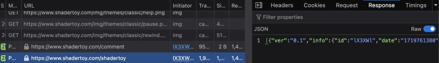

# Self-hosting sketches from ShaderToy

1) Visit the ShaderToy sketch in your browser (needed because of Cloudflare validation)
2) Watch network traffic in the development console. Look for the request that downloads a JSON with the sketch's content:  
   
3) Save the response into `public/shadertoys` as `sk3tch.json` (keeping the sketch's ID).
4) In `assets/projects.js` use this URL: `https://creativecode.berlin/shadertoys/?shader=sk3tch`

### Background

To make this work, we are hosting three files that come from ShaderToy:
- effect.js
- piLibs.js
- index.html

The HTML has a few embedded scripts. These have been manually edited so the sketch is shown in embed mode, and no requests are made to unneeded assets like button images. The initial logic made a POST request to `/shadertoy`. This has been replaced with the `?shader=` query parameter.
